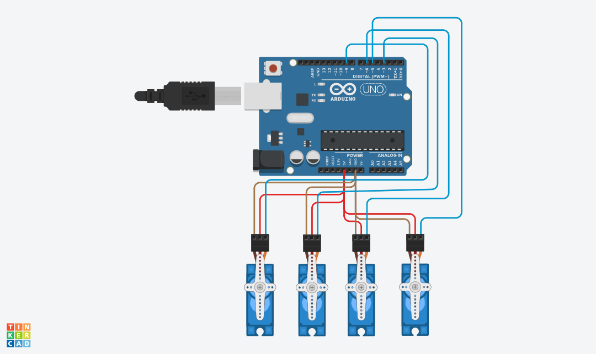

# 🤖 Arduino 4-Servo Sweep & Hold System

This repository contains an Arduino Uno sketch that drives 4 micro servo motors through a timed sweep-then-hold sequence, built and verified in Tinkercad Circuits as a technical task for the SmartMethods summer training program.

## 📋 Project Objective

Program 4 micro servo motors to execute two sequential movement phases:

1. **Sweep Phase (first 2 seconds):** all 4 servos rotate back and forth simultaneously.
1. **Hold Phase (after 2 seconds):** all 4 servos stop sweeping and lock at 90° for the remainder of the run.

## 🔌 Hardware & Wiring

|Servo  |Signal Pin|Power|Ground|Wire Color (Signal / Power / GND)|
|-------|----------|-----|------|---------------------------------|
|Servo 1|3 (PWM)   |5V   |GND   |Blue / Red / Brown               |
|Servo 2|5 (PWM)   |5V   |GND   |Blue / Red / Brown               |
|Servo 3|6 (PWM)   |5V   |GND   |Blue / Red / Brown               |
|Servo 4|9 (PWM)   |5V   |GND   |Blue / Red / Brown               |

> **Note:** all 4 signal wires are the same blue, so color alone doesn’t distinguish which wire goes to which servo — the Signal Pin column above is the reliable reference.

In this Tinkercad simulation, all 4 servos are wired directly to the Arduino’s 5V and GND pins. Each signal wire runs directly from its servo to the matching digital pin.

> ⚠️ **Hardware note:** in a physical build (outside simulation), powering 4 servos from the Arduino’s onboard 5V regulator can cause brownouts, since the combined startup current draw exceeds what the regulator is rated for. A real build would need a separate external 5V supply for the servos, with its ground tied to the Arduino’s ground (common ground).

## 💻 How the Code Works

The sketch tracks elapsed time with `millis()` to check the 2-second boundary between the two phases, paced by a short `delay(15)` per movement step. Because `delay()` blocks execution between checks, the transition can land a few milliseconds after the 2000ms mark rather than exactly on it — negligible for this task, but worth stating plainly rather than as an exact guarantee.

**Phase 1 — Sweep (0–2000 ms):**

- `angle` starts at 0 and changes by `direction * 5` every 15 ms.
- When `angle` reaches 0 or 180, `direction` flips sign, producing continuous back-and-forth motion.
- All 4 servos are written to the same `angle` on every step, so they move in sync.
- **Design choice — step size of 5°:** a classic 1°-per-step sweep at 15 ms/step takes ~2.7 seconds to complete just one direction (180 × 15 ms), which wouldn’t even finish a single pass within the 2-second window. A 5° step completes a full back-and-forth cycle in ~1.08 seconds, giving a clearly visible oscillation that fits the 2-second requirement with room to spare.

**Phase 2 — Hold (after 2000 ms):**

- All 4 servos are written to 90° once.
- A `while (true) {}` loop then halts further code execution, keeping the program in this state indefinitely.
- Note: the Servo library drives the motors through a hardware timer interrupt independent of `loop()`, so a single `write(90)` call is technically enough to hold position — the `while(true)` here is an explicit, easy-to-read way to freeze the program in the hold state. Worth keeping in mind if the project later grows to include more sensors or outputs, since nothing after this point in `loop()` would ever run again.

## 🎥 Demo

*Drag and drop your video file here instead of this line to embed the simulation demo.*

## 🧪 Testing in Tinkercad

1. Build the circuit per the wiring table above.
1. Open **Code → Text**, paste in `four_servo_sweep_hold.ino`.
1. Click **Start Simulation**.
1. Expected result: all 4 servos sweep back and forth for ~2 seconds, then lock at 90° and stay there.

## 📁 Files in This Submission

- `four_servo_sweep_hold.ino` — Arduino sketch
- `README.md` — this file
- Demo video showing the sweep-then-hold behavior in simulation
- (optional) circuit screenshot — only needed if you keep the embedded image link above; remove that line if you don’t add the file

-----

# 🤖 نظام تحكم بأربعة محركات Servo — حركة Sweep ثم ثبات (Hold)

يحتوي هذا المستودع على كود Arduino Uno يتحكم في أربعة محركات Servo صغيرة (Micro Servo) وفق تسلسل زمني محدد: حركة أرجحة (Sweep) يعقبها ثبات (Hold)، وقد تم بناء المشروع واختباره بالكامل على منصة Tinkercad Circuits ضمن مهمة تقنية في التدريب الصيفي لبرنامج SmartMethods.

## 📋 هدف المشروع

برمجة أربعة محركات Servo صغيرة لتنفيذ حركتين متتاليتين:

1. **مرحلة الـ Sweep (أول ثانيتين):** تتحرك المحركات الأربعة يمينًا ويسارًا بشكل متكرر ومتزامن.
1. **مرحلة الـ Hold (بعد الثانيتين):** تتوقف جميع المحركات عن الحركة وتثبت عند زاوية 90° لبقية مدة التشغيل.

## 🔌 التوصيل (Hardware & Wiring)

|المكوّن |بن الإشارة|التغذية|الأرضي|لون السلك (الإشارة / التغذية / الأرضي)|
|-------|----------|-------|------|--------------------------------------|
|Servo 1|3 (PWM)   |5V     |GND   |أزرق / أحمر / بني                     |
|Servo 2|5 (PWM)   |5V     |GND   |أزرق / أحمر / بني                     |
|Servo 3|6 (PWM)   |5V     |GND   |أزرق / أحمر / بني                     |
|Servo 4|9 (PWM)   |5V     |GND   |أزرق / أحمر / بني                     |

> **ملاحظة:** جميع أسلاك الإشارة الأربعة بنفس اللون الأزرق، ولذلك لا يمكن الاعتماد على اللون وحده للتمييز بين الأسلاك؛ يُعدّ عمود رقم البن (Signal Pin) أعلاه المرجع الموثوق لتتبع كل توصيلة.

في هذه المحاكاة على Tinkercad، تُوصَل المحركات الأربعة مباشرة ببنّي 5V وGND في لوحة الأردوينو، دون استخدام لوحة تجارب (Breadboard). كما يمتد كل سلك إشارة مباشرة من محرك السيرفو إلى البن الرقمي المقابل له.

> ⚠️ **ملاحظة هندسية:** في حال التنفيذ الفعلي خارج بيئة المحاكاة، فإن تغذية أربعة محركات Servo من منظم الجهد الداخلي في لوحة الأردوينو قد تتسبب في هبوط مفاجئ للجهد (Brownout)، نظرًا لأن التيار اللحظي المطلوب عند بدء الحركة يتجاوز قدرة المنظم الداخلي. ولتفادي ذلك، يجب استخدام مصدر تغذية خارجي بجهد 5V للمحركات، مع ربط طرف الأرضي (GND) الخاص به بأرضي لوحة الأردوينو (Common Ground).

## 💻 آلية عمل الكود

يعتمد الكود على دالة `millis()` لمراقبة الحد الزمني الفاصل بين المرحلتين (2000 ميلي ثانية)، إلى جانب استخدام `delay(15)` قصيرة لضبط سرعة كل خطوة من خطوات الحركة. وبما أن دالة `delay()` توقف تنفيذ باقي الكود خلال فترة الانتظار، فإن الانتقال بين المرحلتين قد يحدث بعد الحد الزمني المحدد بفارق بسيط (بضعة ميلي ثوانٍ) وليس عنده بالضبط — وهو فارق لا تأثير له عمليًا في هذه المهمة، لكن من الأدق ذكره بوضوح بدلًا من وصف التوقيت بأنه دقيق تمامًا.

**المرحلة الأولى — Sweep (من 0 إلى 2000 ميلي ثانية):**

- يبدأ المتغير `angle` من القيمة 0، ويتغير بمقدار `direction * 5` كل 15 ميلي ثانية.
- عند وصول الزاوية إلى 0 أو 180 درجة، ينعكس اتجاه الحركة `direction`، مما ينتج حركة أرجحة مستمرة.
- تكتب جميع المحركات الأربعة القيمة نفسها للزاوية `angle` في كل خطوة، فتتحرك بشكل متزامن.
- **قرار تصميمي — اختيار خطوة بمقدار 5 درجات:** لو اعتُمدت خطوة كلاسيكية بمقدار درجة واحدة كل 15 ميلي ثانية، فإن إتمام اتجاه واحد فقط من الحركة (0 إلى 180 درجة) كان سيستغرق نحو 2.7 ثانية (180×15 ميلي ثانية)، أي أن الحركة لن تكتمل حتى منتصفها خلال أول ثانيتين. أما اختيار خطوة بمقدار 5 درجات فيتيح إتمام دورة أرجحة كاملة (ذهابًا وإيابًا) خلال نحو 1.08 ثانية، ما ينتج حركة واضحة تتوافق مع متطلب الثانيتين مع هامش إضافي.

**المرحلة الثانية — Hold (بعد 2000 ميلي ثانية):**

- تكتب المحركات الأربعة زاوية 90 درجة مرة واحدة.
- تليها حلقة `while (true) {}` توقف تنفيذ باقي الكود، ويبقى البرنامج في هذه الحالة إلى ما لا نهاية.
- **ملاحظة:** تعتمد مكتبة Servo على مؤقّت (Timer Interrupt) مستقل عن حلقة `loop()` لتشغيل المحركات، لذا فإن استدعاء `write(90)` مرة واحدة كافٍ من الناحية التقنية للحفاظ على الثبات؛ ويُعد استخدام `while(true)` هنا أسلوبًا واضحًا وسهل القراءة لتجميد البرنامج عند حالة الثبات. تجدر الإشارة إلى أن أي كود يُضاف لاحقًا (كحساسات أو مخرجات إضافية) لن يُنفَّذ أبدًا بعد هذه النقطة داخل `loop()`.

## 🎥 العرض التوضيحي (Demo)

*اسحبي وأفلتي ملف الفيديو الخاص بكِ هنا بدلاً من هذا السطر لتظهر المحاكاة مضمّنة.*

## 🧪 التجربة على Tinkercad

1. بناء الدارة وفق جدول التوصيل أعلاه.
1. فتح قائمة **Code ← Text**، ولصق كود `four_servo_sweep_hold.ino`.
1. الضغط على **Start Simulation**.
1. النتيجة المتوقعة: تتأرجح المحركات الأربعة لمدة ثانيتين تقريبًا، ثم تثبت عند زاوية 90° وتبقى كذلك.

## 📁 الملفات المرفقة بهذا التسليم

- `four_servo_sweep_hold.ino` — كود الأردوينو
- `README.md` — هذا الملف
- فيديو يوضح سلوك Sweep ثم Hold أثناء المحاكاة
- (اختياري) صورة من الدارة — تلزم فقط إذا أبقيتِ رابط الصورة المضمّن أعلاه؛ احذفي ذلك السطر إذا لم تضيفي الملف